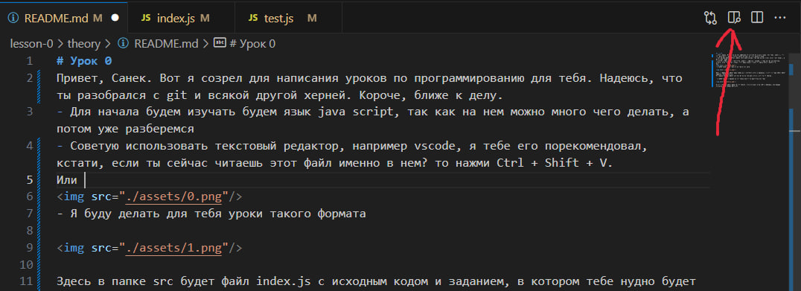
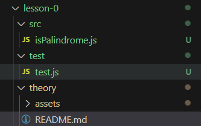
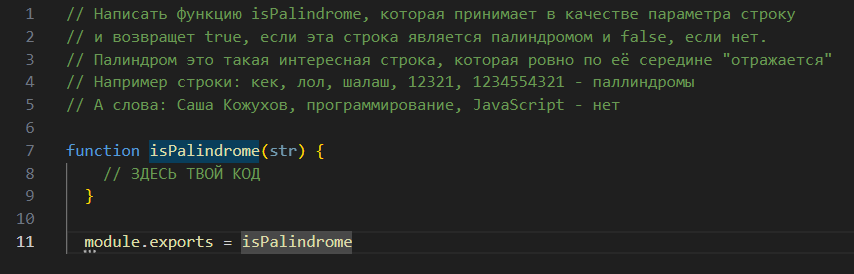

# Урок 0
Привет, Санек. Вот я созрел для написания уроков по программированию для тебя. Надеюсь, что ты разобрался с git и всякой другой херней. Короче, ближе к делу.
- Для начала будем изучать будем язык java script, так как на нем можно много чего делать, а потом уже разберемся
- Советую использовать текстовый редактор, например vscode, я тебе его порекомендовал, кстати, если ты сейчас читаешь этот файл именно в нем? то нажми Ctrl + Shift + V.

Или вот эту кнопочку в будщем.



- Я буду делать для тебя уроки такого формата



Здесь в папке src будет файл index.js с исходным кодом и заданием, в котором тебе нудно будет написать некоторый код.
А в файле test.js будет код для проверки тех адгоритмов, которые ты описал.

- Я буду делать в файлах js вот такие некоторые заготовки для тебя



В которых тебе нужно будет просто писать свой код алгоритма внутри функции, где указан комментарий 

```// ЗДЕСЬ ТВОЙ КОД```

- И так файл для написания кода готов, файл с тестами тоже, объясню, что мы делаем для того, чтобы оно все работало
