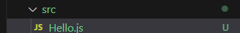
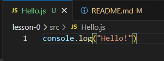
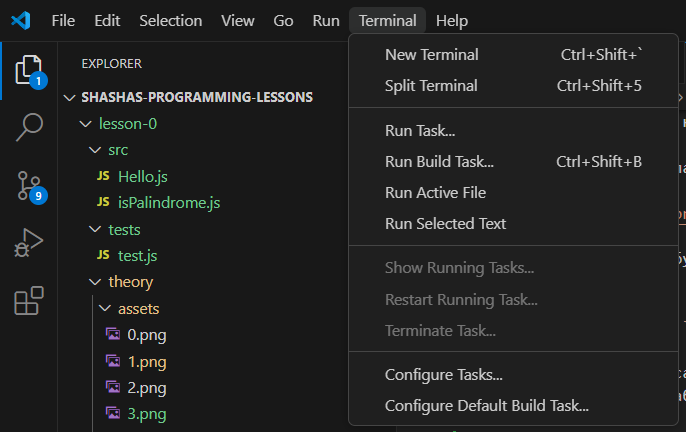
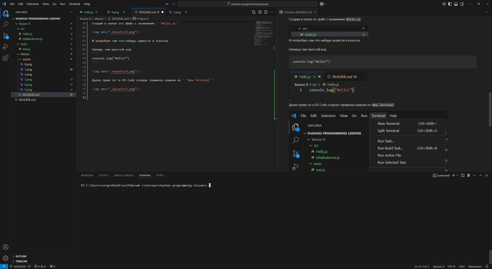
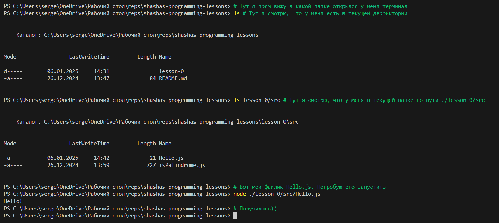
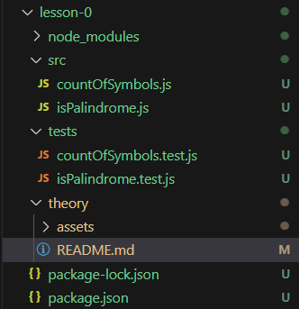
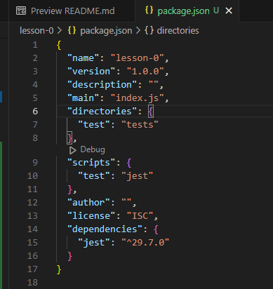
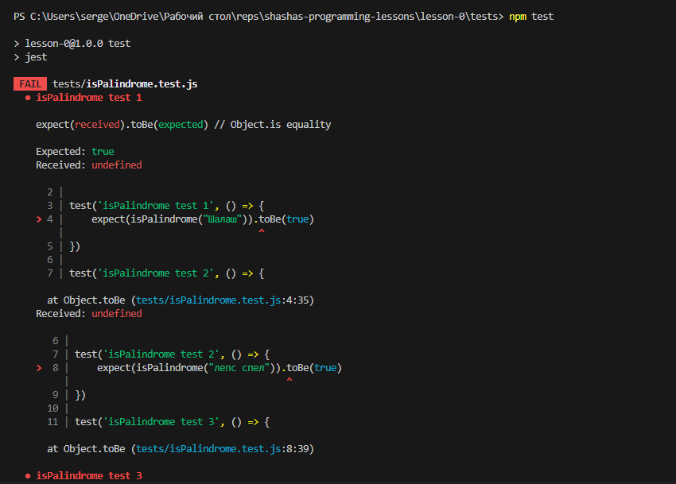

# Урок 0
Привет, Санек. Вот я созрел для написания уроков по программированию для тебя. Надеюсь, что ты разобрался с git и всякой другой херней. Короче, ближе к делу.
- Для начала будем изучать будем язык java script, так как на нем можно много чего делать, а потом уже разберемся
- Советую использовать текстовый редактор, например vscode, я тебе его порекомендовал, кстати, если ты сейчас читаешь этот файл именно в нем? то нажми Ctrl + Shift + V.

Или вот эту кнопочку в будщем.


- Я буду делать для тебя уроки такого формата


Здесь в папке src будет файлы с расширением .js с исходным кодом и заданием, в котором тебе нудно будет написать некоторый код.
А в папке tests будет код для проверки тех алгоритмов, которые ты описал.

- Я буду делать в файлах js вот такие некоторые заготовки для тебя


В которых тебе нужно будет просто писать свой код алгоритма внутри функции, где указан комментарий 

```// ЗДЕСЬ ТВОЙ КОД```

- И так файл для написания кода готов, файл с тестами тоже, объясню, что мы делаем для того, чтобы оно все работало

Как ранее я уже говорил, язык программирование выберем пока что js, я тебе скидывал курсик по нему. Для выполнения кода на этом ЯП нам потребуется среда выполнения, она называется node.js

Ссылка для скачивания:
<a src="https://nodejs.org/en/download">https://nodejs.org/en/download</a>

Тут можно ради интереса почитать про эту платформу:
<a src="https://en.wikipedia.org/wiki/Node.js">https://en.wikipedia.org/wiki/Node.js</a>

Для того, чтобы запустить код нужно просто ввести команду типа
```
node [путь к нашему js файлу]
```

Создам в папке src файо с названием ```Hello.js```



И попробую там что-нибдуь вывести в консоль

Напишу там простой код
```
console.log("Hello!")
```



Далее прям тут в VS Code открою терминал кликом по ```New Terninal```



И у меня снизу он откроется



Думаю, простые cmd и unix комманды ты уже знаешь, но если нет, то ыстро их выучишь



И так текущая структура проекта у нас такая



Здесь есть то, что тебе нужно и то, что пока что не не сет смысловой нагрузки

Например папка ```node_modules``` и файлы ```package-lock.json``` и ```package.json```

Но вкратце расскажу про них...

Так как мы используем платформу разработки ```Node.js``` - это довольно большое
программное обеспечение, оно позволяет не только запускать код, но также предоставляет доступ
к репозиториям с различными библиотеками. Что я сделал?
Я в терминале находясь в папке ```lesson-0``` ввёл команду ```npm init``` и инициализировал
node.js проект. У меня появился файлик ```package.json```, который содержит ифнормацию о проекте, например "он знает" какие у меня в проекте используются библиотеки. Их же называют
пакетами. Что такое ```NPM```? ```NPM``` - это просто аббревиатура, которая расшифровывается, как Node Package Manager - менеджер пакетов Node.

Далее я ввел команду ```npm install jest``` у меня сразу же началась загрузка npm пакета jest,
с помощью которого я написал для тебя юнит тесты, которые ты будешь запускать, чтобы ты мог проверять свой код, автоматически =)

Как запустить тесты? Надо просто ввести команду в терминал ```npm run test``` или ```npm test``` это запустит скрипт теста, который описан в файлике package.json в секции scripts, который в свою очередь запустит jest



и мы увидим в консоли много всякого страшного, ну потому что код еще не написан) 



