Санёк, привет! 

Вот и новый урок для тебя =)

Задания для него следует будет делать в папке ```lesson-1```

Тут уже будет чуть тяжелее, чем в прошлый раз

В этот раз:
- Ты чуть подробнее разберёшься с тем, как работать с ```git```
- Узнаешь, что такое ```pull request```
- Узнаешь, что такое ```TDD```
- Сам создашь ```Node.js``` проект
- Сам напишешь ```Unit тесты``` для своего кода
- Узнаешь, что такое ```CI-CD```
- И зашаришь за магию автоматизации = )

И так, приступим...

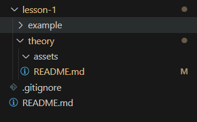

Начальная структура каталога ```lesson-1``` выглядит таким образом, но в процессе твоей работы она изменится. Для себя я создал каталог ```example``` просто, чтобы я там мог что-то делать, чтобы наделать для тебя скриншоты, которые ты видишь здесь. 

- Начнем с работы с ```git```

Что-то ты уже умеешь и знаешь, но возможно что-то новое я тебе сейчас покажу.

Перейду в терминал

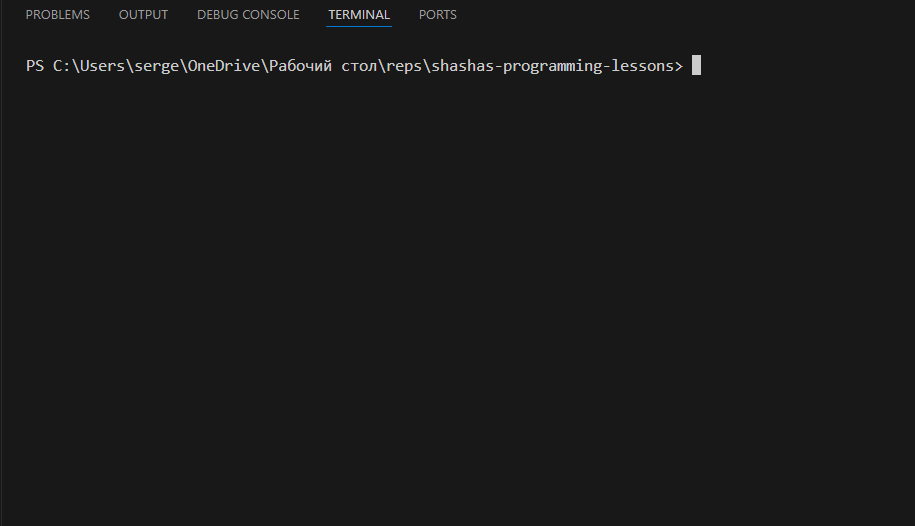

Введу команду ```git status```

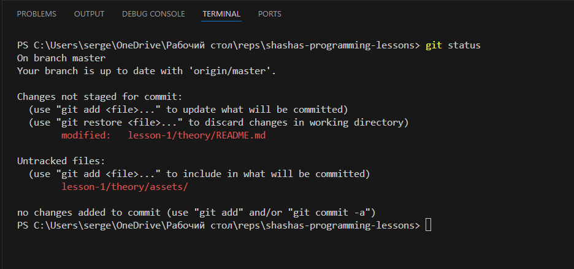

Тут ```git``` (по скольку я нахожусь в папке, которая является git репозиторием) мне 
выдаёт некоторую информацию о текущем положении дел.

Он говорит мне, что я нахожусь на ветке ```master``` так обычно называют главную ветку репозитория, а также я тут вижу, что у меня есть некоторые не отслеживаемые к изменениям файлы.

По скольку я сейчас только делаю для тебя этот урок, я не хочу, чтобы он находился на ветке мастер. Я выведу новую, чтобы в ней работать

Введу команду ```git checkout -b [наименование ветки]```

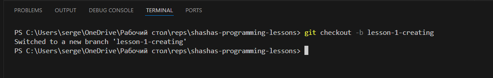

Кстати, в левом нижнем углу я могу видеть текущую ветку (ветку на которой я нахожусь)

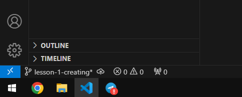

Важно понимать, что такое удаленный(remote) репозиторий и что такое локальный репозиторий.
Наш remote репозиторий был создан на гитхабе и хранится где-то там на серверах, а то что у тебя и меня на компьютерах - это локальные репозитории. Поэтому хоть я и создал новую ветку у себя, в удаленном репозитории она появится только при пуше в репозиторий.

Давай я попробую сохранить промежуточные изменения своей ветки и запушить в наш с тобой репозиторий

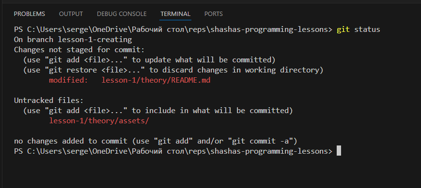

```git status``` по прежнему показывет не отслеживаемые изменения текущего файла и всей папки, где я храню картинки 

Я сделаю их отслеживаемыми введу команду ```git add [путь/пути к файлам]```

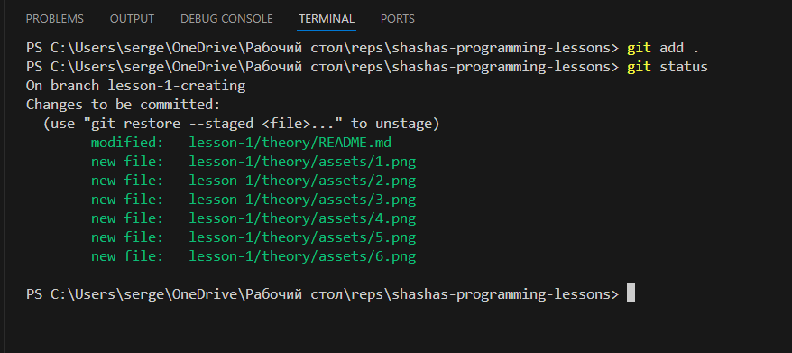

Я ввел ```git add .``` точка говорит о том, что я добавляю в отслеживаемые все файлы рекурсивно, которые находятся в текущей папке. Теперь они светятся зеленым цветом, гит их отслеживает.

Теперь мне нужно их "закоммитить". Выполню команду ```git commit -m "сообщение к коммиту"```.

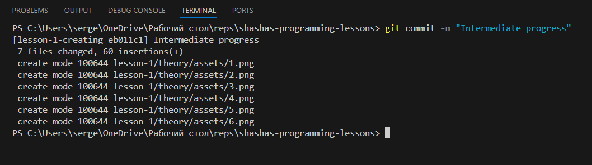

"Закоммитил" - теперь изменения и главное история изменений были сохранены в локальном репозитории

Выполню команду ```git log -n 3```, чтобы посмотреть информацию о 3 последних коммитах

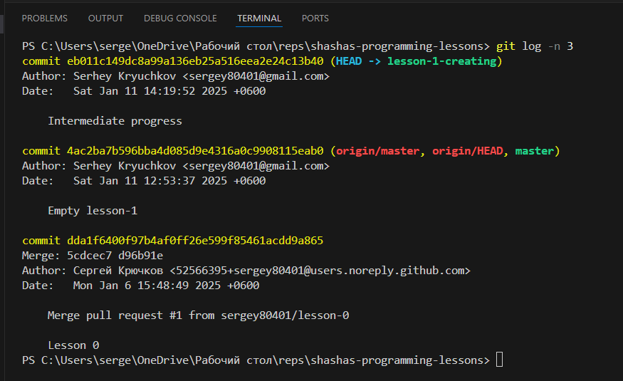

Но в удаленном репозитории на ```github``` ничего не появилось

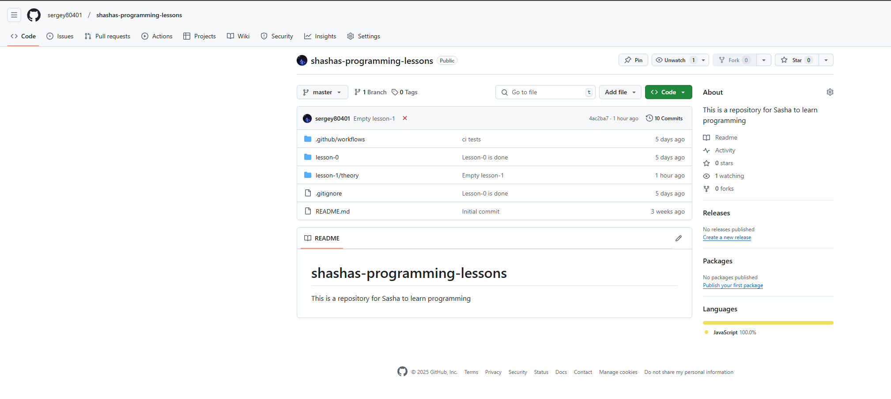

Показывает, что одна ветка только.

Чтобы синхронизировать наши репозитории (локальный и ремоут), надо выполнить команду ```git push```

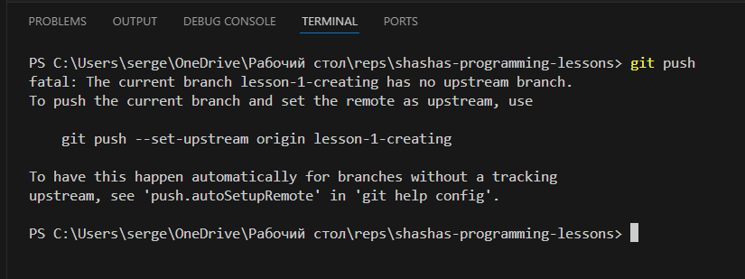

Эх, не получилось. Потому что гит не понимает с какой веткой в удаленном репозитории производить синхронизацию нашей ветки. Однако сам гит, нам предлагает ввести команду, которая создаст в удаленном репозитории новую ветку ```git push --set-upstream origin lesson-1-creating```.

Введем её!

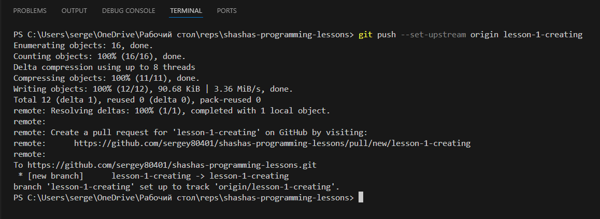

И у нас все получилось.

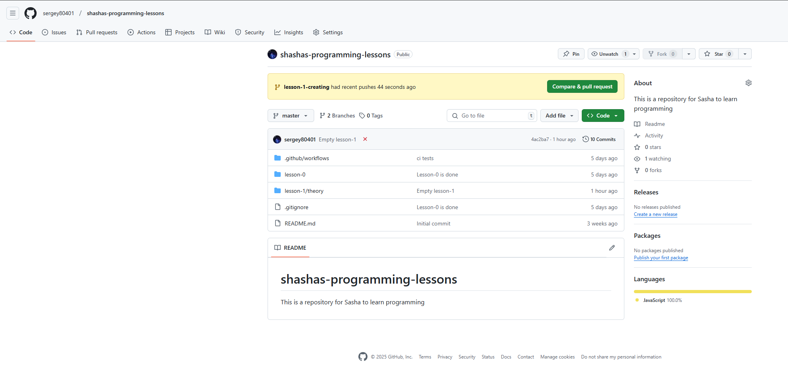

Гитхаб теперь показывает, что у нас 2 ветки, и что была создана новая ветка ```lesson-1-creating```. И он даже предлагает нам создать ```pull request```. Но об этом попозднее