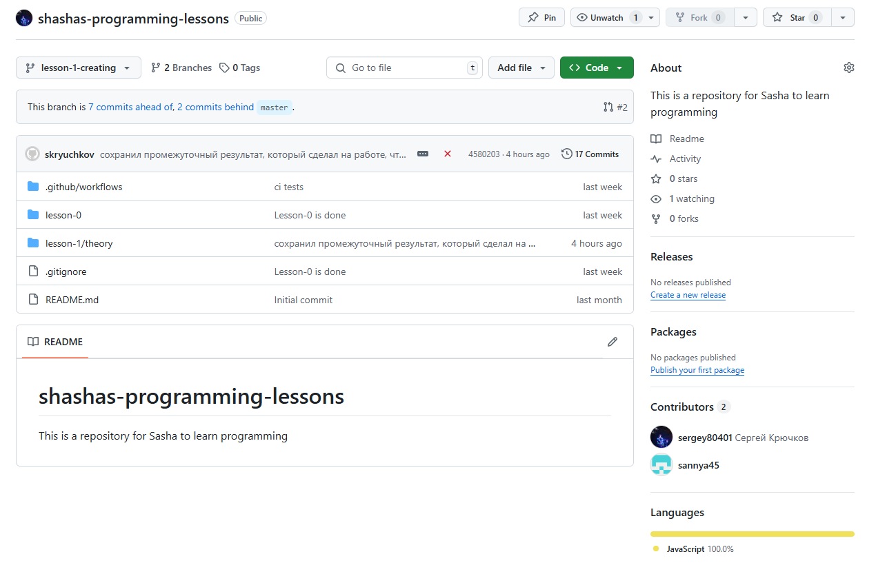

Санёк, привет! 

Вот и новый урок для тебя =)

Задания для него следует будет делать в папке ```lesson-1```

Тут уже будет чуть тяжелее, чем в прошлый раз

В этот раз:
- Ты чуть подробнее разберёшься с тем, как работать с ```git```
- Узнаешь, что такое ```pull request```
- Узнаешь, что такое ```TDD```
- Сам создашь ```Node.js``` проект
- Сам напишешь ```Unit тесты``` для своего кода
- Узнаешь, что такое ```CI-CD```
- И зашаришь за магию автоматизации = )

И так, приступим...


Начальная структура каталога ```lesson-1``` выглядит таким образом, но в процессе твоей работы она изменится. Для себя я создал каталог ```example``` просто, чтобы я там мог что-то делать, чтобы наделать для тебя скриншоты, которые ты видишь здесь. 

- Начнем с работы с ```git```

Что-то ты уже умеешь и знаешь, но возможно что-то новое я тебе сейчас покажу.

Перейду в терминал


Введу команду ```git status```


Тут ```git``` (по скольку я нахожусь в папке, которая является git репозиторием) мне 
выдаёт некоторую информацию о текущем положении дел.

Он говорит мне, что я нахожусь на ветке ```master``` так обычно называют главную ветку репозитория, а также я тут вижу, что у меня есть некоторые не отслеживаемые к изменениям файлы.

По скольку я сейчас только делаю для тебя этот урок, я не хочу, чтобы он находился на ветке мастер. Я выведу новую, чтобы в ней работать

Введу команду ```git checkout -b [наименование ветки]```


Когда ты будешь выполнять свое задание, тебе тоже нужно будет делать все в отдельной ветке!

Кстати, в левом нижнем углу я могу видеть текущую ветку (ветку на которой я нахожусь)


Важно понимать, что такое удаленный(remote) репозиторий и что такое локальный репозиторий.
Наш remote репозиторий был создан на гитхабе и хранится где-то там на серверах, а то что у тебя и меня на компьютерах - это локальные репозитории. Поэтому хоть я и создал новую ветку у себя, в удаленном репозитории она появится только при пуше в репозиторий.

Давай я попробую сохранить промежуточные изменения своей ветки и запушить в наш с тобой репозиторий


```git status``` по прежнему показывет не отслеживаемые изменения текущего файла и всей папки, где я храню картинки 

Я сделаю их отслеживаемыми введу команду ```git add [путь/пути к файлам]```


Я ввел ```git add .``` точка говорит о том, что я добавляю в отслеживаемые все файлы рекурсивно, которые находятся в текущей папке. Теперь они светятся зеленым цветом, гит их отслеживает.

Теперь мне нужно их "закоммитить". Выполню команду ```git commit -m "сообщение к коммиту"```.


"Закоммитил" - теперь изменения и главное история изменений были сохранены в локальном репозитории

Выполню команду ```git log -n 3```, чтобы посмотреть информацию о 3 последних коммитах


Но в удаленном репозитории на ```github``` ничего не появилось


Показывает, что одна ветка только.

Чтобы синхронизировать наши репозитории (локальный и ремоут), надо выполнить команду ```git push```


Эх, не получилось. Потому что гит не понимает с какой веткой в удаленном репозитории производить синхронизацию нашей ветки. Однако сам гит, нам предлагает ввести команду, которая создаст в удаленном репозитории новую ветку ```git push --set-upstream origin lesson-1-creating```.

Введем её!


И у нас все получилось.


Гитхаб теперь показывает, что у нас 2 ветки, и что была создана новая ветка ```lesson-1-creating```. И он даже предлагает нам создать ```pull request```.


Кликнем на зелёную кнопочку и создадим ```pull request``` это запрос на втягивание нашей ветки и всех наших изменений в основную ветку.


Тут можно написать каку-то информацию для ревьювера.


Вот мы и создали наш пул реквест

Так в принципе и производится разработка больших программ и приложений. Большое количество разработчиков делают какую-то функциональность в отдельной ветке, создают ```pull request```ы.
Потом кто-то их все ревьювит и вливает в основную ветку.

Тут мы видим, какие-то ошибки, пишет, что какие-то проверки не прошли =(

Но это не страшно, это просто отрабатывает наш ```CI-CD```, который я сделал еще в самом начале на ```lesson-0```, чтобы твои тесты на твой код запускались автоматически. Просто в этой ветке еще нет твоего кода, поэтому и видем красненькое, потому что тесты падают.

Что же такое ```CI-CD```?

CI/CD (Continuous Integration / Continuous Deployment) — это набор практик и инструментов, направленных на автоматизацию процессов разработки, тестирования и развертывания программного обеспечения. Основная цель CI/CD — ускорить и упростить доставку качественного кода в production, минимизируя ручные операции и снижая вероятность ошибок.

Основные компоненты CI/CD:
- Continuous Integration (CI) — Непрерывная интеграция

- - Разработчики часто объединяют свои изменения в общий репозиторий (например, Git).

- - Каждое изменение автоматически проверяется с помощью сборки и тестов (юнит-тесты, интеграционные тесты и т.д.).

- - Цель: быстро выявлять и устранять конфликты и ошибки, обеспечивая стабильность кода.

- Continuous Delivery (CD) — Непрерывная поставка

- - После успешной сборки и тестирования код автоматически подготавливается к развертыванию в production-среде.

- - Развертывание может быть выполнено вручную (по требованию) или автоматически.

- - Цель: обеспечить готовность кода к выпуску в любой момент.

- Continuous Deployment (CD) — Непрерывное развертывание

- - Расширение Continuous Delivery, где каждое успешное изменение автоматически развертывается в production.

- - Цель: максимально ускорить доставку новых функций и исправлений пользователям.

```
Преимущества CI/CD:
Скорость: Ускорение процессов разработки и выпуска обновлений.
Качество: Раннее обнаружение ошибок благодаря автоматическому тестированию.
Надежность: Минимизация рисков при развертывании.
Автоматизация: Снижение зависимости от ручных операций.
Гибкость: Возможность быстро реагировать на изменения требований.
```

Мы пока остановимся только на ```CI```, без всяких там ```CD```

Нам это потребуется для того, чтобы при каждом изменении в коде запускались тесты.

В больших компаниях процессы ```CI-CD``` так же используется для автоматического деплоймента. К примеру разработчик добавил на сайт новую кнопку и на стороне сервера описал логику работы приложения, при нажатии на эту кнопку. Закоммитил, запушил и создал пулл реквест. В приложении для хотсинга типа ```github``` (Их много всяких разных бывает) или другой ```CI-CD``` системе запускается ```pipeline``` (пайплайн), где выполняется статистический анализ кода, юнит тесты, UI тесты и всякое, всякое разное. Только после "зеленых" тестов этот код уходит на код ревью, после чего (если замечаний нет) пуллреквест мерджится и происходит раскатка на прод. Если что-то не понял, спрашивай)

И так для перового урока, точнее нулевого я уже сам написал тебе тесты и ci, которое запускает, но в этот раз ты сделаешь это сам.

Давай посмотри, что произойдет, если я сейчас произведу пуш в репозиторий промежуточного результата?

Выполню знакомые тебе команды...

```
git add...
git commit...
git push
```

И вот, что вижу на гитхабе на своей ветке, на которой делаю для тебя этот урок



Пишет, что что-то было запушено 4 часа назад, еще какой-то крестик красный, говорящий о том, что, что-то не так

Если я перейду в раздел ```actions```, то увижу следующее...


Все пайплайны красные, за исключением двух, которые выполнились, когда ты залил в свою ветку код к первому заданию, и когда я влил твою ветку в мастер

На моей ветке пока что нет твоих ихменений, сейчас исправим это. Выполню последовательно некоторые команды гита...

Вот так выглядит мой терминал:


Давай по порядку, что я сделал?

```git checkout master``` - Я переключился на ветку мастер, я знаю, что там есть твои изменения.

```git pull``` - Тут я стянул твои изменения, т.е. синхронизировал свою локальную ветку мастер с той, что находится в удаленном репозиторие.

```git checkout lesson-1-creating``` - Обратно "зачекаутился" на свою ветку

```git merge master``` - Влил свою локальную ветку мастер в свою ```lesson-1-creating```

Тут же был произведен, автоматический "мёрдж коммит". И я выполнил ```git push```


Теперь в нашем репозиторие на гитхабе и на моей ветке пайлайн зеленый, потому что тесты выполнились на твой код, который и в моей ветке теперь есть. Ветку тебе стоит воспринимать, как некоторый "слепок" или "чекпоинт проекта", как сохранения в играх.

Где же хранятся эти пайплайны и CI-CD???

Ты наверное мог заметить папочку ```.github```, когда выполнял первый урок. Вот там все и есть. Там лежит файлик ```test.yml``` в папке ```workflows```. Каждый раз, когда происходит какое-то событие в удаленном репозиторие, например: пуш, создание новой ветки или создание пул реквеста (кстати, если встретишь терминологию ```merge request``` "мёрдж реквест", это одно и то же)

```pull-request === merge-request // =)```

Просто существуют аналоги гитхаба, например гитлаб, просто гитхаб один из самых распространенных. (Можешь поспрашивать про это меня в тг или поузнавать об аналогах самостоятельно)

Так шо-то отвлеклись, посмотрим, что из себя представляет файлик ```.github/workflows/test.yml``` в нашем репозиторие.

Он вышлядит вот так:

```
name: Tests
on: push
jobs:
  lesson-0-tests:
    runs-on: ubuntu-latest
    steps:
    - uses: actions/checkout@v2
    - name: Install modules
      run: cd ./lesson-0 && npm install
    - name: Run tests
      run: cd ./lesson-0 && npm run test
```

Здесь в дериктиве ```name``` указано имя пайплайна - Test

В ```on``` указано наименование события, по которому производится вызов этого пайплайна (каждый пуш он триггерится)

А в директиве ```jobs``` указана перечнь "джоб", тех приколов, которые выполняются

Тут пока что одна джоба и она выглядит вот так.


 Назвал я ее ```lesson-0-tests```, т.е. тесты для перовго урока. У любой джобы в свою очередь тоже есть некоторое колличество директив, например тут есть
: ```runs-on``` и ```steps``` нам пока что этого хватает, но есть и другие...

 ```runs-on``` отвечает за то, на каком образе ```docker``` запускать джобу, однажды я тебе расскажу, что это такое, но блять я уже хуярю 250 строчку текста... Сорян...

 Пока что нужно принять, что ```runs-on: ubuntu-latest``` будет запускать твой пайплайн в ```ОС``` ```linus ubuntu``` последлней версии. Далее идет директива  ```steps```, где есть типа специальные директивы, типа ```- uses: actions/checkout@v2```, которая автоматически делает так, что в рамках нашего пайплайна, автоматические в нашу "виртуальную" ```ОС``` ```linus ubuntu``` будет клонирован репозиторий, а далее будет произведен "чекаут" (переход) на текущую ветку.

Далее идут простые степы, они же шаги, друг за другом, которые выполняют простые ```bash``` скрипты:

1) Install modules
2) Run tests

Первый вызывает ```cd ./lesson-0 && npm install```, переходит в ```lesson-0``` и в этой папке вызывает ```npm install``` - ты это уже делал.

Второй калабахает команду ```cd ./lesson-0 && npm run test```, он выполняет в папке ```lesson-0``` команду ```npm run test```, а именно запускает тесты. И это ты тоже делал в нулевом уроке. Видишь как изи все, ахахаха!

Такс, что там осталось по плану? ```TDD``` и создание собственного проекта в ```Node.Js```. Ща покажу. Все по порядку. 

Что такое ```TDD```?

```TDD``` - это аббревиатура, которое расшифровывается так - Test-Driven Development.
Что переводится как разработка через тестирование. Это значит, что сначала пишутся тесты для функционала, который еще не написан, а потом уже пишется сам код, сама реализация функционала! И на тестах проверяется код, который мы написали. Это максимизирует качество кода при разработке и помогает избегать потенциальных багов и ошибок. Прикол еще заключается в том, что ты думаешь над тем, как должен работать код в момент, когда ты его еще не начал писать. Ты пишешь только тесты, а это сильно проще.

Теперь про создание проекта в ```Node.Js```.

Как я ранее и говорил, я все буду делать в папке ```example```.

Выполню команду ```pwd```, чтобы узнать в какой директории я сейчас нахожусь

Далее перейду в ```lesson-1/example```, выполнив ```cd ./lesson-1/example```

А потом, выполню команду ```npm init```. Эта команда инциализирует ```Node.Js``` проект. Сама нода мне там что-то предлагает выбирать, но сейчас нам достаточно просто ```Enter``` проклацать.


Что в итоге произошло?

В моей папке ```example``` создался файлик ```package.json```. О нём я ранее рассказывал, еще в ```lesson-0```, он нужен, для того, чтобы система ```Node.Js``` понимала, что текащая директория является "корнем" "нодовского" проекта.

Давай взглянем на этот файл  ```package.json```?

Сейчас он выгляди так:


```
{
  "name": "example",
  "version": "1.0.0",
  "description": "",
  "main": "index.js",
  "scripts": {
    "test": "echo \"Error: no test specified\" && exit 1"
  },
  "author": "",
  "license": "ISC"
}
```

Тут есть имя, версия, описание, точка входа, какие-то нахуй скрипты, автор и лицензия. Тут нам ничего не нужно, за исключением "scripts". Тут перечислены скрипты проекта. По умолчанию нода создает скрипт "test" для тестирования кода, но там всего лишь команда, которая говорит нам, что тесты не определены и завершается с кодом 1. Эти скрипты очень легко запустить. Надо выполнить команду ```npm run [наименование скрипта]```. Давай выполним (важно находиться в директории ```Node``` проекта).


Результат ожидаемый...

Я могу в секцию "scripts" в файле ```package.json``` добавить что-то такое:

```
"scripts": {
    "test": "echo \"Error: no test specified\" && exit 1",
    "say_blablabla": "echo blablabla"
  },
```

И выполнить ```npm run say_blablabla```


Вновь результат ожадаем.

Нам нужно что-то для тестов, давай спросим у нейросетки?


Удивительно, но первое, что он посоветовал, это ```jset``` - ```npm пакет или же библиотека для юнит тестирования.

Даже показал, как установить и пользоваться. В хорошее время живем!

Выполняем... (пока не обращаем внимания на флаги ```--save-dev```. По большому счету особо не влияет)


Что-то у нас скачалось.

Теперь давай напишем тест, для кода, который пока не написан. В своей папке ```example``` я создам 2 папочки ```tests``` - для тестов и ```src``` (source) (source code) для самого исходного кода.

Хотя стой. Хотя стой, совсем забыл рассказать. 

После того, как я установил зависимость ```jest``` струткра моего каталога вот так вот изменилась.


Тут появился еще один ```.json``` файл и папка ```node_modules```

```
Файл package-lock.json автоматически генерируется в проектах на Node.js при использовании менеджера пакетов npm (начиная с версии 5). Он выполняет несколько важных функций:

1. Фиксация версий зависимостей
package-lock.json фиксирует точные версии всех установленных пакетов и их зависимостей. Это гарантирует, что все разработчики в команде и окружения (например, production и development) используют одинаковые версии пакетов.

Без этого файла разные установки (например, на разных машинах) могут привести к использованию разных версий пакетов, что может вызвать проблемы с совместимостью.

2. Детерминированная установка
Файл обеспечивает детерминированную установку зависимостей. Это означает, что команда npm install всегда установит одинаковые версии пакетов, независимо от времени или окружения.

Это особенно важно для CI/CD (непрерывной интеграции и доставки), чтобы избежать неожиданных изменений в поведении приложения.

3. Оптимизация установки
package-lock.json содержит информацию о дереве зависимостей, что позволяет npm оптимизировать процесс установки, избегая дублирования пакетов и ускоряя установку.

4. Контроль изменений
Файл позволяет отслеживать изменения в зависимостях. Если вы используете систему контроля версий (например, Git), изменения в package-lock.json покажут, какие пакеты были обновлены, добавлены или удалены.

5. Совместимость с package.json
В package.json указываются диапазоны версий пакетов (например, ^1.2.3), что позволяет устанавливать новые совместимые версии. Однако package-lock.json фиксирует конкретные версии, которые были установлены в момент последнего запуска npm install.
```

А в папке ```node_modules``` просто хранятся наши библиотеки, которые мы устанавливаем с помощью ```npm``` или ```yarn``` (```Node.js``` поддерживает несколько пакетных менеджеров)

Что я там говорил про ```TDD```? Напишем тесты!


Папочки я создал. Иииии допустим я хочу написать функцию суммирования двух чисел.

Да, это глупо, но для примера подойдет идеально. 

Создам файл ```getSum.test.js``` в папке ```tests```

(Важно, чтобы в наименовании файла с кодом теста фигрировало ```test``` только так библиотека ```jest``` поймет, что там тесты и запустит этот файл)

Также создам сам файл для реализации функции ```getSum```.

И так вот заготовка для файла с исходным кодом и для тестов, соответственно:


Попробуем тесты запустить!

Введем привычную нам команду, которую мы узнали на ```lesson-0``` - ```npm run test```


Ой, забыли поправить ```package.json```

Испрвим в этом файле секцию "scripts" таким образом

```
"scripts": {
    "test": "jest"
  }
```

Чтобы при команде ```npm run test``` запускался ```jest```, который рекурсивно ищет все тестовые ```.js``` файлы и запускает их.

Попробуем запустить еще раз.


Запустил и сразу же пошли "отъебы", но оно и понятно, код, то для функции я еще не писал.
