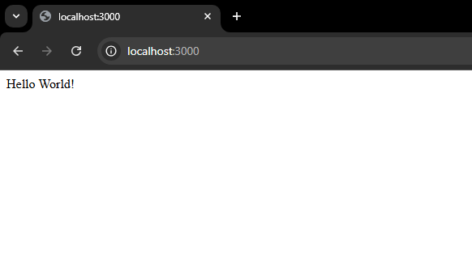

Добро пожаловать на урок №2!!!

Как там с шашками решил? Я тоже нет, хахааха!

Ладно, задача реально сложная, потом решим.

(А может ты и решил, хз...)

Я уже выполнил привычные тебе приколы. В этом уроке также буду использовать папочку ```example``` для себя, а ты делай все в ```lesson-2```.

Сегодня поговорим немножно про ```backend``` (бэк)

Вот, что будет в списке наших задач в рамках этого урока:

1) Узнаем, что такое ```http``` и как с ним работать.
2) Узнаем что такое БД (базы данных)
3) Познакомимся с ```SQL```, с помощью этой штуки сделаем папу-тройку запросов в БД
4) Первый раз создадим собственный бэкенд: свою апишку (```API```), которая будет обрабатывать наши запросы извне.
5) Раскатим всё это в докере ```docker```

```
Капец, Санечек, если ты это все выкупишь, то к выпуску из уника будешь сеньором. Бля был бы у меня такой учитель в свое время
```

Ну и конечно же это все не без нашего ```CI``` и тестах, о которых мы узнали ранее.

Для знакомства с протоколом ```http``` оветую почитать эти статейки:

<a src=https://habr.com/ru/articles/215117>https://habr.com/ru/articles/215117</a>

<a src=https://habr.com/ru/articles/813395>https://habr.com/ru/articles/813395</a>

А также, если вдруг что-то не понял, то постарайся поузнавать и поискать всякое про http самостоятельно

Так же рекомендую прочитать эту статейку про REST

<a src=https://habr.com/ru/articles/483202>https://habr.com/ru/articles/483202/</a>

Также стоит понимать, что такое лямда функции, стрелочные функции, понимать, что такое ```call-back``` и уметь этим пользоваться из js. (Это все у нейросетки изи спросить)

В папке ```example``` я создам папку ```server``` и создам там небольшое ```WEB-приложение```, которое сможет обрабатывать ```http``` запросы. Для создания веб приложений на платформе Node.js существует огромное количество библиотек и фреймоворком, доступ к которым мы так же как и ранее получаем через npm. Сегодня мы остановимся на фреймворке ```Express.js```


[Вот его сайтик](https://expressjs.com)

Там есть документация и даже пример для быстрого старта. И так зайду в нужную мне папку и создам там node проект, а потом установлю ```Express.js```


Как и в прошлый раз: ```npm init``` и проклацал энтер.

Далее тут же выполню ```npm install express```, чтобы скачать экспресс.


Все установилось и появилась папка ```node-modules``` и файл ```package-lock.json```


А содержимое файла ```package.json``` теперь такое.


В секции ```dependencies``` видим что у нас в проекте есть ```express``` версии ```4.21.2```

Теперь создам файлик ```app.js```, где буду описывать логику поведения нашего первого веб приложения.


Первое, о чем мы должны знать - это ```require```.

Это стандартная функция в Node.js для загрузки модулей.

Далее я написал некоторый код в файле ```app.js```


Кстати, обрати внимание как я вывожу значение переменной прямо в строку.
Это называется ```интерполированная строка``` или ```шаблонная строка```.
Такое есть почти во все языках программирования.

Здесь я
- Получил доступ к библиотеке express
- Создал экземпляр приложения
- Определил порт
- Создал обработчик GET-запроса, который будет отрабатывать всегда, когда к нашему приложению будет приходить запрос по пути "/" и с методом GET.
- Определил, что при запуске приложение будет прослушивать указанный мной порт.

И так давай запустим, запускать код в ноде ты уже умеешь!


Вот и запустили

Что произошло, да все то, что в коде написано, аххаах.

Но как выполнить GET-запрос? Самый легкий способ - это через браузер.

Напишу в строке браузера ```http://localhost:3000``` и вот, что увижу:



Мой бэкенд отработал, я получил ответ на запрос. Кстати, если я открою в бразуере ```dev-tools``` (инструменты разработчика), а там перейду на вкладку ```network```, то смогу увидеть, что при открытии/обновлении страницы по адресу ```http://localhost:3000``` выполняется как раз таки GET-запрос


Чтобы погасить приложение, в терминале нужно клацнуть ```Ctrl + C```. Приложение остановится, я смогу внести какие-то изменения в файлы с исходным кодом, сохранить, а потом своё серверное приложение переподнять, чтобы перепроверить логику работы приложения


Но я не лох, чтобы постоянно ходить в терминал, чтобы перезапускать сервак!!!